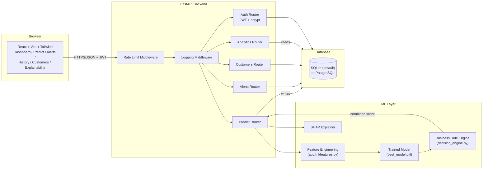
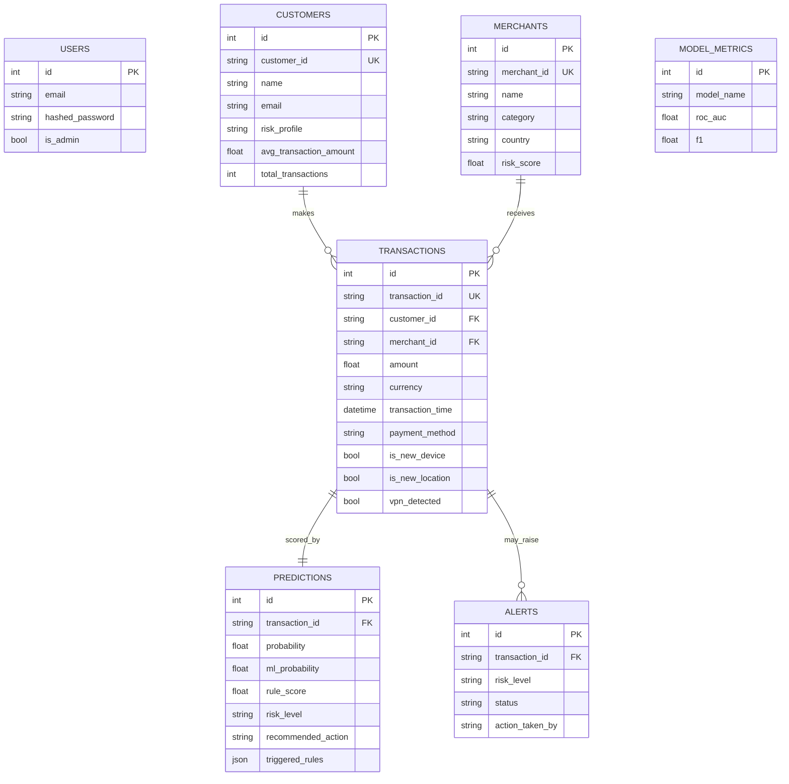
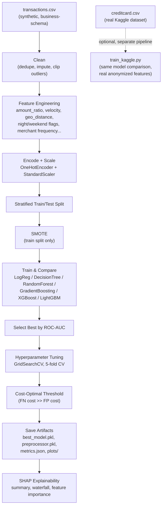
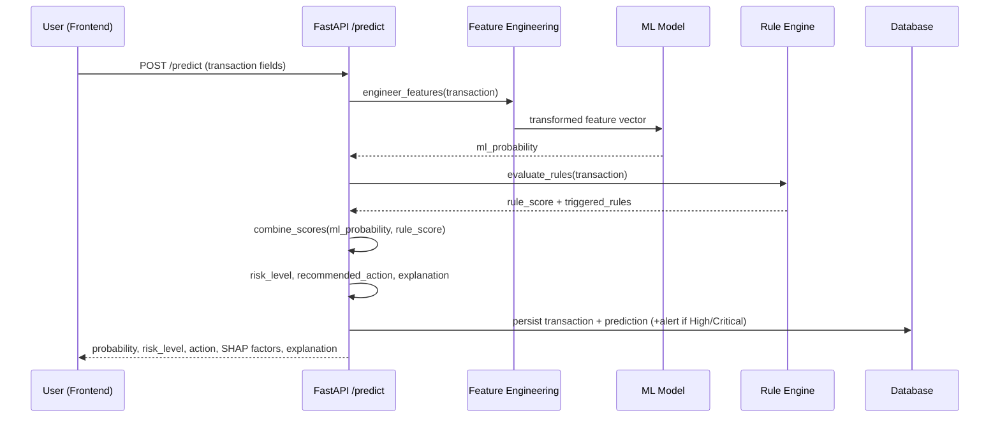
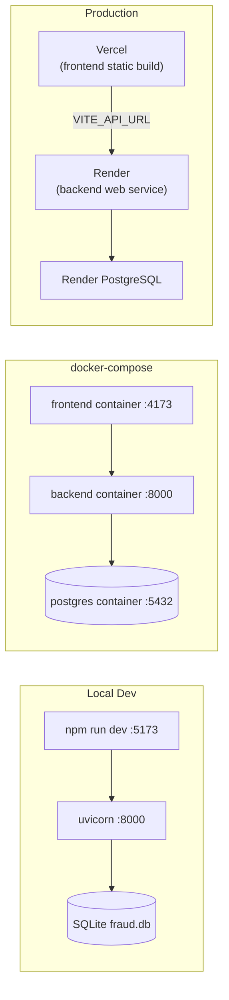

# Architecture

## System Architecture

```mermaid
flowchart LR
    subgraph Client["Browser"]
        UI["React + Vite + Tailwind\nDashboard / Predict / Alerts /\nHistory / Customers / Explainability"]
    end

    subgraph API["FastAPI Backend"]
        AUTH["Auth Router\nJWT + bcrypt"]
        PRED["Predict Router"]
        ALERTS["Alerts Router"]
        CUST["Customers Router"]
        ANALYTICS["Analytics Router"]
        RATE["Rate Limit Middleware"]
        LOG["Logging Middleware"]
    end

    subgraph ML["ML Layer"]
        FEAT["Feature Engineering\n(app/ml/features.py)"]
        MODEL["Trained Model\n(best_model.pkl)"]
        RULES["Business Rule Engine\n(decision_engine.py)"]
        SHAP["SHAP Explainer"]
    end

    subgraph DB["Database"]
        SQLITE[("SQLite (default)\nor PostgreSQL")]
    end

    UI -- "HTTPS/JSON + JWT" --> RATE --> LOG --> AUTH
    LOG --> PRED
    LOG --> ALERTS
    LOG --> CUST
    LOG --> ANALYTICS

    PRED --> FEAT --> MODEL --> RULES
    RULES -- "combined score" --> PRED
    PRED --> SHAP
    PRED -- "writes" --> DB
    ALERTS --> DB
    CUST --> DB
    ANALYTICS -- "reads" --> DB
    AUTH --> DB
```

## Database ER Diagram

```mermaid
erDiagram
    USERS {
        int id PK
        string email
        string hashed_password
        bool is_admin
    }
    CUSTOMERS {
        int id PK
        string customer_id UK
        string name
        string email
        string risk_profile
        float avg_transaction_amount
        int total_transactions
    }
    MERCHANTS {
        int id PK
        string merchant_id UK
        string name
        string category
        string country
        float risk_score
    }
    TRANSACTIONS {
        int id PK
        string transaction_id UK
        string customer_id FK
        string merchant_id FK
        float amount
        string currency
        datetime transaction_time
        string payment_method
        bool is_new_device
        bool is_new_location
        bool vpn_detected
    }
    PREDICTIONS {
        int id PK
        string transaction_id FK
        float probability
        float ml_probability
        float rule_score
        string risk_level
        string recommended_action
        json triggered_rules
    }
    ALERTS {
        int id PK
        string transaction_id FK
        string risk_level
        string status
        string action_taken_by
    }
    MODEL_METRICS {
        int id PK
        string model_name
        float roc_auc
        float f1
    }

    CUSTOMERS ||--o{ TRANSACTIONS : makes
    MERCHANTS ||--o{ TRANSACTIONS : receives
    TRANSACTIONS ||--|| PREDICTIONS : scored_by
    TRANSACTIONS ||--o{ ALERTS : may_raise
```

## ML Pipeline

```mermaid
flowchart TD
    A["transactions.csv\n(synthetic, business-schema)"] --> B["Clean\n(dedupe, impute, clip outliers)"]
    B --> C["Feature Engineering\namount_ratio, velocity, geo_distance,\nnight/weekend flags, merchant frequency..."]
    C --> D["Encode + Scale\nOneHotEncoder + StandardScaler"]
    D --> E["Stratified Train/Test Split"]
    E --> F["SMOTE\n(train split only)"]
    F --> G["Train & Compare\nLogReg / DecisionTree / RandomForest /\nGradientBoosting / XGBoost / LightGBM"]
    G --> H["Select Best by ROC-AUC"]
    H --> I["Hyperparameter Tuning\nGridSearchCV, 5-fold CV"]
    I --> J["Cost-Optimal Threshold\n(FN cost >> FP cost)"]
    J --> K["Save Artifacts\nbest_model.pkl, preprocessor.pkl,\nmetrics.json, plots/"]
    K --> L["SHAP Explainability\nsummary, waterfall, feature importance"]

    M["creditcard.csv\n(real Kaggle dataset)"] -.optional, separate pipeline.-> N["train_kaggle.py\n(same model comparison,\nreal anonymized features)"]
```

## Real-Time Prediction Flow

```mermaid
sequenceDiagram
    participant U as User (Frontend)
    participant API as FastAPI /predict
    participant FE as Feature Engineering
    participant M as ML Model
    participant R as Rule Engine
    participant DB as Database

    U->>API: POST /predict (transaction fields)
    API->>FE: engineer_features(transaction)
    FE->>M: transformed feature vector
    M-->>API: ml_probability
    API->>R: evaluate_rules(transaction)
    R-->>API: rule_score + triggered_rules
    API->>API: combine_scores(ml_probability, rule_score)
    API->>API: risk_level, recommended_action, explanation
    API->>DB: persist transaction + prediction (+alert if High/Critical)
    API-->>U: probability, risk_level, action, SHAP factors, explanation
```

## Deployment

```mermaid
flowchart LR
    subgraph Local["Local Dev"]
        FE1["npm run dev :5173"]
        BE1["uvicorn :8000"]
        DB1[("SQLite fraud.db")]
    end

    subgraph Docker["docker-compose"]
        FE2["frontend container :4173"]
        BE2["backend container :8000"]
        DB2[("postgres container :5432")]
    end

    subgraph Cloud["Production"]
        VERCEL["Vercel\n(frontend static build)"]
        RENDER["Render\n(backend web service)"]
        RENDERPG["Render PostgreSQL"]
    end

    FE1 --> BE1 --> DB1
    FE2 --> BE2 --> DB2
    VERCEL -- "VITE_API_URL" --> RENDER --> RENDERPG
```
